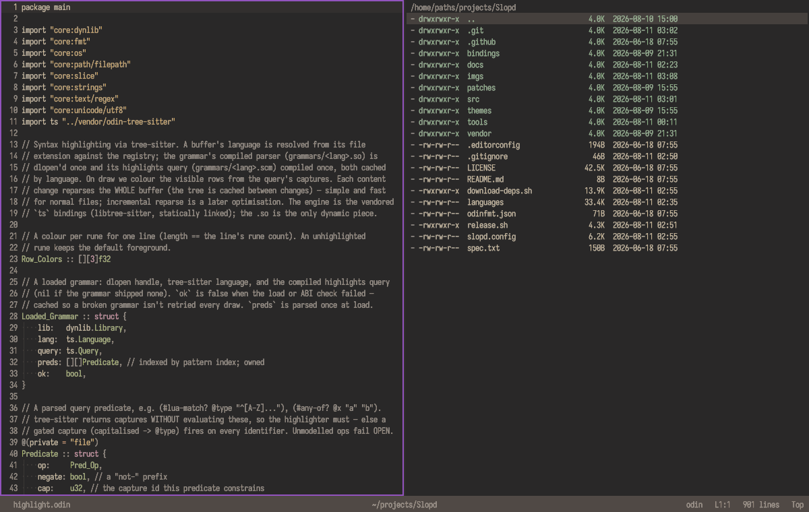
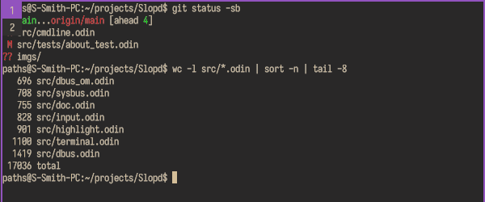
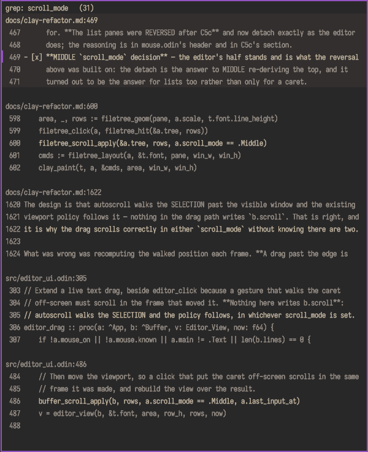
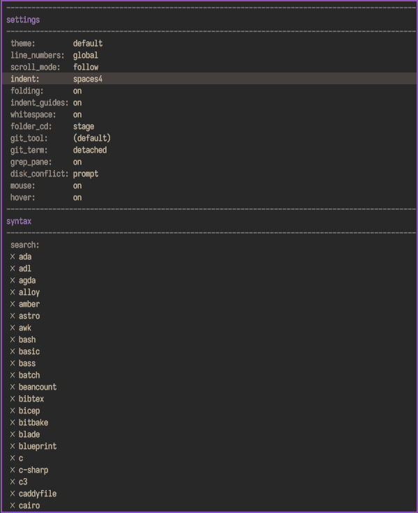
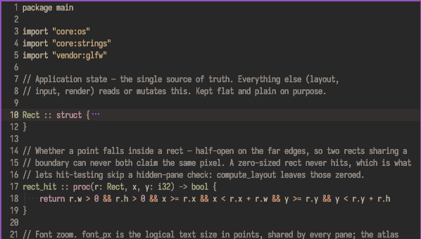
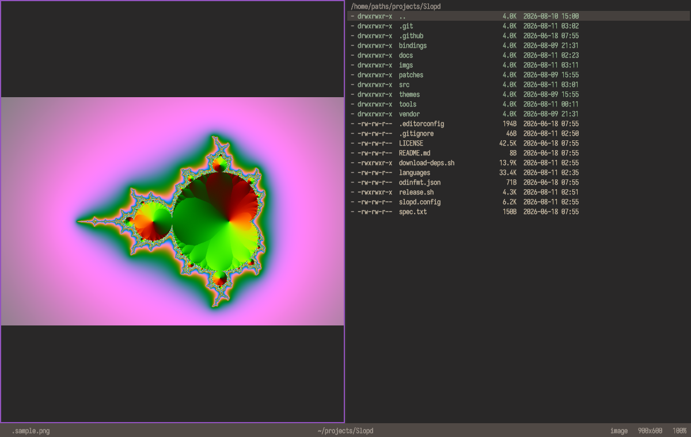

# Slopd

A GPU text editor in [Odin](https://odin-lang.org): two panes, a command line, no modes.
iTree-sitter highlighting, real PTY terminals, an image viewer, one static ~2.4MB binary.
Linux, OpenGL 3.3.

```sh
curl -fsSL https://github.com/ItsNotPaths/Slopd/releases/latest/download/install.sh | sh
```

## Build

```sh
./download-deps.sh                 # vendors glfw, libvterm, tree-sitter, the font + icons
./release.sh --local               # or: stripped -o:speed build into build/
```

| | |
|---|---|
| **main surfaces** | `Text` (the buffer ring) · `Image` (the media viewer) |
| **aux modes** | `FileTree` (as an `ls` listing or a file browser) · `Terminal` · `Config` · `Grep` · `Binds` |
| **views** | `Split` both panes · `Zen` full-width editor, aux slides in while focused · `Full` one surface fills the window |

Views are toggled from the command line: `:zen`/`:zm`, `:full`/`:fm`, `:normal`/`:nm`. `Esc` with
nothing to cancel turns Zen on and flips which side is shown.

## Keys

Non-modal / Alt-rooted: bare keys type, arrows navigate, chords live under Alt.

| | |
|---|---|
| `Alt+Left/Right`, `Alt+E` | focus editor / aux |
| `Alt+F` `Alt+T` `Alt+R` | aux mode: filetree, terminal, grep results |
| `Alt+P` | workspace jump: the file pane's top bar becomes `WORKSPACE/` — the open ring, unsaved first, then fuzzy matches over the project's files as you type |
| `Alt+C` `Alt+;` | command line: a shell line · the same line with the builtin `:` typed |
| `Alt+W` | open it pre-filled with `:j `, ready for a line number |
| `Alt+Enter` | editor: follow the token under the caret (def / URL / `[[file]]` / colour) · filetree: `:cd` to the folder |
| `Shift+Enter` | filetree: open in the desktop app, or stage a runnable's command |
| `Alt+1..9`, `Alt+Up/Down` | terminal session N / prev / next (switcher shows while Alt is held) |
| `Alt+N` `Alt+Q` `Alt+L` | terminal: new · close · lock its cwd |
| `Ctrl+Alt+Up/Down`, `PageUp/Down` | terminal copy cursor (`Shift+Alt+Up/Down` extends) |
| `Ctrl+C` at a terminal | copies its selection; with nothing selected it is the job's interrupt |
| `Alt+G` | hand the project root to the configured git tool |
| `Alt+A` + arrow | drop a multi-cursor trail (`Alt+M` = next motion moves all, `Esc` collapses) |
| `Ctrl+Up/Down`, `PageUp/Down` | jump `jump_lines` lines · `Ctrl+Enter` fold/unfold the block |
| `Ctrl+Home` `Ctrl+End` | the top and the end of the document |
| `Home` | the indentation, then column 0 — press again to go back |
| `Tab` `Shift+Tab` | indent / unindent. A selection crossing lines moves those WHOLE lines and survives, so Tab twice is two levels |
| `Ctrl+/` | comment or uncomment the lines you are on, by the file's extension. A block with any bare line goes commented first |
| `Alt+[` `Alt+]` | nudge the split · `Ctrl+=` `Ctrl+-` `Ctrl+0` font zoom |
| `Ctrl+S/Z/Y/C/X/V` | save, undo, redo, clipboard — a save permissions refuse stages a `sudo` line in the CL |
| `Ctrl+A` `Ctrl+L` | select the whole document · select the line, at every cursor (`Ctrl+E` is still end-of-line) |

Filetree file ops are `Ctrl` chords (`^y` mark, `^u` unmark all, `^c` copy, `^x` cut, `^v`
paste, `^d` delete, `^w` path, `^k` discard the selected file's unsaved edits, `^h` set the
workspace to the browsed folder — `:cd` plus `:tu` in one keystroke); hold `Ctrl` for the
cheat-sheet bar under EITHER face, or **right-click** for the same list as buttons.

`Alt+Q` discards here too. It is the terminal's close chord, and that verb declines wherever its
pane is not up, so the file pane is offered the key next and takes it.

`Alt+P` puts a `WORKSPACE/` prompt in that pane's top bar, under either face. With nothing typed
it lists what is open: the unsaved ones first (red, starred), then the rest of the ring. Type and
it lists fuzzy matches over every file under the project root instead. `Up`/`Down` pick, `Enter`
opens, `Esc` puts the listing back untouched.

What it walks is the config's `exclude:` line, a one comma-separated list of directory names in
grep's own `--exclude-dir` syntax (`exclude: .git, vendor, node_modules`), shared by the prompt,
`:grep`, Alt+Enter and the by-name file lookups, and editable as a text row in the Config pane.

## File browser

Browser and list modes, list is simply ls -la, browser is dolphin esque with grid+list modes.

| | |
|---|---|
| `^←` `^→` `^r` | history back / forward · reload — the three square buttons |
| `^g` | list ⇄ grid (the toggle button; `file_view` persists it) |
| `^1`..`^9` | open the sidebar's Nth place |
| `Backspace` | up a directory — and the only way out of a grid, where `←`/`→` step a tile |
| click the path's empty space | the path bar becomes a text line — type or paste a folder |
| right-click | the file-ops menu, at the pointer; on empty space it acts on the folder (paste, set workspace here) |

## Command line

`Alt+C` opens it, and what you type is a **shell** command, run in a terminal session. A Slopd
**builtin** is asked for by name with a leading `:` — `grep foo` is the program, `:grep foo` is
the project search in the Grep pane. `Alt+;` opens the line with the `:` already typed.

A submitted line is an `&&` chain of both kinds, mixed: shell steps run in a terminal session and
the chain waits on each exit code, builtins run inside Slopd. `rm -rf old && :ls` is the shell's
delete followed by our listing refresh — the line `^d` stages for you. Text staged by a UI
gesture renders in the alert colour until you touch it.

| | |
|---|---|
| `:tN` | send this line's shell parts to session N (`:t2 make`) · alone, a goto |
| `:j` / `:jump` | `:j 40`, `:j +5`, `:j file`, `:j file 40`. A jump that lands somewhere else leaves the line BACK to where it was in the history, so `Alt+C` then `Up` is the return trip |
| `:f` / `:find` | literal search of the open buffer; smart case, `Up`/`Down` cycle the hits, `Shift+Enter` takes all of them |
| `:grep <re>` | project-wide search into the Grep pane, filled live as you type |
| `:rep <old> <new>` | project-wide LITERAL replace; the pane previews the result, `Shift+Enter` applies it into unsaved buffers (`:wa` writes, `:discard` backs one out) |
| `:cd [dir]` | set the project root · `:tu` syncs unlocked terminals |
| `:ls` `:cf` `:gs` `:bind` | filetree (also: refresh) · config · git tool · key bindings (`:binds` too) |
| `:rebind [+\|-\|N] <action> [chord]` | edit a binding — `:rebind + nav.down alt+j` |
| `:macro [-] <chord> [!]<command>` | put a command line on a chord — `:macro alt+1 !git status && :ls`; `:macros` opens the block |
| `:put [text]` | type text + the editor selection into the target terminal, no newline |
| `:reload y\|n` | answer a disk conflict: take the disk version, or keep mine (`:w` overwrites) |
| `:readme` `:license` | open the embedded docs |
| `:zen` `:full` `:normal` | view arrangement |
| `:w :wa :q :q! :wq :wqa` | write / quit, the only way out; guarded by the unsaved ring — which is the buffers with a FILE waiting for them, so an untitled scratch buffer never holds the session open |
| `:w <path>` | write a COPY there and stay on this file, as vim does; `:w! <path>` overwrites an existing one. A buffer with NO file is NAMED instead: it takes the path and is saved |
| `:discard [file]` | throw a buffer's unsaved edits away and take the disk version back |
| `:saved` | the tail of the staged sudo save: mark clean IF the disk already holds this buffer |
| `:return [path...]` | only while Slopd is somebody's file dialog: answer with these paths and quit. No path takes the marks, or the row under the cursor. `:return!` overwrites in save mode |
| `:crlf` | flip this buffer between CRLF and LF line endings; the modeline says `CRLF` |

**Saving a file you do not own.** `Ctrl+S` (or `:w`) on a file the filesystem refuses does not
fail quietly: the buffer is written to a private copy under `$XDG_RUNTIME_DIR`, and the line that
carries it over is staged for you to read and run —

```
sudo cp '/run/user/1000/slopd-4213-1-hosts' '/etc/hosts' && :saved
```

The shell half runs in a real terminal (t1 by default, configurable), which is where `sudo` can ask for the password, and the
`&&` gates the rest: a wrong password stops the chain, so the buffer stays dirty and nothing
claims a save that did not happen. `:saved` then checks the file against the buffer before it
marks it clean.

**Opening a file you may not read.** The same answer, the other way round: an open the
filesystem refuses stages the line that unlocks the file and opens it again —

```
sudo chmod a+r '/etc/shadow' && :j /etc/shadow
```

`a+r`, because the file is someone else's and the owner's bits are not the ones locking you out.
This one changes the file for everybody, which is why it is staged and not run: read it, edit it,
then press Enter.

**A save never truncates the file.** The bytes go to a temp file beside the target, reach the
disk, and one rename swings the name over. A crash, a kill or a full disk in the middle costs
the save, not the file. The file keeps its own permissions, and a symlinked file is written
through to what it points at.

**Line endings survive.** A file that breaks its lines with `\r\n` is edited as if it did not,
and saved back the way it came, so a one-line edit is a one-line diff. `:crlf` flips a buffer
either way — for converting a file, or for saying what a new one gets.

**The two `cd`s.** `:cd src` moves Slopd's project root — what `:grep` searches, what the file
panes list, where a new terminal starts. A bare `cd src` is the shell's own, moving that one
session. Neither follows the other; `:tu` pushes the root into every unlocked session when you
want them back in step (`^h` in the file panes is those two builtins in one keystroke).

<table>
<tr>
<td width="50%"><b>Terminals</b>, libvterm + a real PTY per session, up to 99. Alt shows the switcher.<br></td>
<td width="50%"><b>Grep pane</b>, <code>:grep &lt;re&gt;</code>, results with context; Enter jumps.<br></td>
</tr>
<tr>
<td><b>Config pane</b> (<code>:cf</code>), every setting is a dropdown; the syntax list installs, updates and uninstalls grammars in place.<br></td>
<td><b>Folding</b> (<code>Ctrl+Enter</code>), collapse the block opening on the line; whitespace dots and the active-scope indent rail are the reading aids beside it.<br></td>
</tr>
<tr>
<td colspan="2"><b>Image viewer</b>, opening an image flips the main pane to the media surface. Wheel zooms about the pointer, drag pans, double-click refits.<br></td>
</tr>
</table>

## File dialog

Slopd will stand in as another program's Save As / Open dialog. It is `--util` with one extra
verb: browse as usual, and `:return` writes the chosen paths to the file named by `--pick-out`,
one absolute path per line, then quits.

```sh
slopd --pick=save --pick-out=/tmp/answer --pick-name=cat.png --pick-title=firefox --~/Downloads
```

`Shift+Enter` on a row STAGES `:return <path>` in the command line rather than answering with
it, and a save arrives with that line already staged against the suggested name. So the common
gesture is Enter, and the useful one is editing the tail first: turn `cat.png` into `cat-2.png`
and you have saved beside the original instead of over it.

Every other way out is a cancel — `Esc`, `:q`, closing the window, a kill — because a cancel is
simply nothing written. Overwriting an existing file in save mode takes `:return!`, the same
bang `:w!` carries.

Nothing in Slopd knows who asked. Whatever started us reads the file back. That keeps the
transport somebody else's problem: a D-Bus portal, a kipp consumer and a shell script all drive
it the same way.

## Install

The release is **one binary**, and everything it needs is inside it. The script downloads it to `~/.local/bin/slopd` and asks whether to add Slopd to your
application list. On Omarchy it also offers a Hyprland window rule. It writes nothing else.
Pass `--yes` to take every default, or `--no-desktop` / `--no-omarchy` to skip a step.

You can also just download the binary and run it. Either way Slopd starts with **no config
file**, so it runs on the defaults baked in and **cannot save a setting.** A binary sitting in
`~/.local/bin` is not an install on its own — the pane's first row reads `not installed` until
the step below writes the config and the folders, and the fix is on that row:

```sh
slopd --install      # write slopd.config out, create themes/ and grammars/
slopd --uninstall    # remove the ~/.local/bin copy; settings and grammars are kept
slopd --where        # which mode, and every path in use
slopd --desktop add  # the application list, on its own (`remove` takes it back off)
```

| | |
|---|---|
| `~/.local/bin/slopd` | the binary |
| `~/.config/slopd/slopd.config` | settings (`$XDG_CONFIG_HOME` if you set it) |
| `~/.local/share/slopd/` | `themes/`, `grammars/`, `perf.log` (`$XDG_DATA_HOME` if you set it) |
| `~/.local/share/applications/slopd.desktop` | the launcher entry, with the icon beside it in `icons/hicolor/` |

Slopd never creates `slopd.config` on its own — `--install` does. **A build folder is
different:** a binary with a `slopd.config` beside it is portable and writes there, so
`./release.sh --local` gives you a `build/` you can change settings in without touching
`~/.config`. Put the binary somewhere you cannot write (`/usr/bin`) and it reads what is
there and writes nothing at all.

## Config

`slopd.config`, simple `key: value` with `#` comments. Editing a setting in the Config pane
rewrites its line in place and leaves the comment alone. No setting can point outside Slopd's
own directories.

The file below is baked into the binary, and it is what `--install` writes out. It is also
**the defaults themselves** — Slopd reads its own copy before it reads yours — so a value here
and the behaviour of a binary with no config file cannot drift apart. Delete a line from your
file and this one applies again.

| key | values | |
|---|---|---|
| `theme` | `default` \| `omarchy` \| `<name>` | a name, never a path: `themes/<name>.theme`. A value with a `/` is refused |
| `indent` | `tab` \| `spaces2` \| `spaces4` … | what Tab inserts |
| `line_numbers` | `global` \| `relative` | gutter |
| `scroll_mode` | `follow` \| `middle` | every line view: move only when the target would leave, or pin it to the middle row |
| `font_size` | int | logical points; `Ctrl +/-` writes it back (debounced) |
| `jump_lines` | int | `Ctrl+Up/Down` and `PageUp/Down` step |
| `whitespace`, `indent_guides`, `folding` | `on` \| `off` | editor reading aids |
| `folder_cd` | `stage` \| `run` | filetree `Alt+Enter`: review the `:cd` in the CL, or run it |
| `discard` | `stage` \| `run` | file pane `^k`: review the `:discard` in the CL, or throw the edits away at once |
| `run_term` | 1-99 | the session the command line works in: its shell lines, its messages, and a program the file pane runs (`:tN` overrides it for one line) |
| `git_tool` | e.g. `lazygit` | what `Alt+G` / `:gs` hands the project root to |
| `git_term` | int \| empty | terminal session to run it in; empty = spawn detached (for a GUI tool) |
| `grep_pane` | `on` \| `off` | `:grep`: always open the results pane vs jump straight on a lone hit |
| `cl_preview` | `on` \| `off` | `:j` `:f` `:grep` `:rep` show what they would do while you type; `Esc` puts it back |
| `disk_conflict` | `prompt` \| `keep` | file changed on disk under unsaved edits |
| `conflict_stage` | `on` \| `off` | a conflict stages `:reload ` in the CL; the modeline marks it `!` either way |
| `mouse`, `hover` | `on` \| `off` | pointer input; hover tints the row under it |
| `file_pane` | `ls` \| `browser` | the filetree pane's face: the dired listing, or the file browser |
| `file_view` | `list` \| `grid` | the browser's contents; its toggle button writes this back |
| `file_icons` | `on` \| `off` | per-type icons in the browser (needs the vendored icon face) |

Three `[section]` blocks sit below the settings and are data rather than knobs: `[places]` is the
browser's sidebar, `[binds]` is the key table, and `[macros]` puts command lines on chords.

## Rebinding

`:bind` / `:binds` (or the Config pane's `bindings` row) opens the binds pane: one row per action, its
chords beside it. Its own keys are fixed, so rebinding cannot lock you out of it.

| | |
|---|---|
| `↑` `↓` | move · `←` `→` cycle which of the row's chords is highlighted |
| `Enter` | edit the highlighted chord, by whichever mode the top toggle is on |
| `Alt+=` `Alt+-` | add a chord to this action · delete the highlighted one (`Backspace` too) |
| `Ctrl+S` | write the block. Blocked while any line is in error |

The top toggle picks how `Enter` edits. **fill in the command line** stages
`:rebind 1 clip.copy ` for you to finish and read before it runs; **capture a keystroke** takes
the next key you press, and asks first if something else holds it. Either way the edit stays in
the pane until you save, so rebinding an arrow does not change the pane under you.

`:rebind` works from anywhere: `+` adds, `-` (or `-N`) clears, a bare `N` replaces the Nth chord,
and no selector replaces the first.

A chord more than one action holds is offered to each in turn, in table order: a verb that has
nothing to do where you pressed it declines, and the next holder gets it. That is how `Alt+Q` is
the terminal's close and the file pane's discard without either one being modal.

The file half is a `[binds]` block of `chord: action` lines over the defaults, `none` to unbind.
A chord is `ctrl`/`alt`/`shift` then the key (`alt+f`, `ctrl+shift+z`, `alt+[`, `f5`), physical.
Shift is not usually written: a Shift chord that matches nothing retries without it and the action
extends, which is what makes `Shift+Down` sweep marks and `^Shift+D` take the marked set.

## Macros

A macro is a chord and a command line: what a binding is to a verb the app holds, a macro is to a
line you would have typed. The Config pane's `macros` row (or `:macros`) opens the block in the
editor, since the value is a command line and the editor edits one better than a row would.

```ini
[macros]
alt+1: !git status && :ls    # ! runs it at once
f5: cargo build              # no ! stages it: read the line, press Enter
```

The command is an ordinary command line, so `&&`, the `:builtins` and a `:tN` target all work.
`:macro alt+1 !git status` sets one from anywhere and writes the block; `:macro - alt+1` drops it.

A macro fires wherever you press it, so it takes a chord no action holds and no bare key — the
loader refuses both, and says so on the Config pane's `macros` row. `Ctrl+Alt+*` and `F5`..`F12`
are the free ground. Changes made by hand in the file are read at the next start.

## Theme

`key: #rrggbb`, `#` comments, unknown keys ignored, so theme files are
interchangeable. Missing keys fall back to the baked-in Gruvbox Material default. Drop
files into the `themes/` folder (`slopd --where` names it).

```
bg fg accent muted urgent
border_light border_dark separator
selection line_highlight
code_keyword code_string code_comment code_number
code_operator code_type code_return_type
cl_inject                                 # staged (auto-filled) command-line text
code_function code_variable code_constant code_punctuation   # Slopd: tree-sitter
whitespace indent_guide indent_guide_active                  # Slopd: editor guides
```

## Syntax

Tree-sitter. `languages` is a generated registry of ~300 languages (ext → grammar repo);
nothing is installed by default. A grammar is cloned and compiled to `grammars/<lang>.so`
on demand, from the Config pane's syntax list, or:

```sh
slopd --grammar install|update|uninstall <lang>
slopd --health [lang]        # ✓/✗ table
```

## CLI & env

| | |
|---|---|
| `--version` / `-v` | build version |
| `--<path>` | launch there: a directory becomes the workspace (`slopd --~/code/thing`), a file opens with its folder as the workspace (`slopd --/etc/fstab`) |
| `--install` / `--uninstall` | copy this binary to `~/.local/bin/slopd` and write its config and folders / remove that copy, keeping the files |
| `--desktop [add\|remove]` | file `slopd.desktop` and its icon under `~/.local/share`, or take them back off |
| `--where` | the mode in force, and every path in use |
| `--util` | launch into Full on the aux pane (filetree fills the window) |
| `--pick=open\|save\|dir` | run as somebody's file dialog — see **File dialog** |
| `--pick-out=<file>` | where `:return` writes the answer |
| `--pick-name=` `--pick-title=` `--pick-multi` | a save's suggested filename · who is asking · allow more than one file |
| `--perflog` | append per-second frame timings to `perf.log` (in the data folder) |
| `--sysbus` | *(parked/WIP)* print one D-Bus snapshot of the watched system services, then exit |
| `$SLOPD_FONT` | `.ttf` to use instead of the bundled Iosevka subset |

## License

GPL-3.0. `:license` in the command line opens the embedded copy.

Embedded fonts keep their own: **Iosevka Fixed** (SIL OFL 1.1) for text, and the file-browser
icons from **Nerd Fonts**' Seti-UI and Devicons sets (both MIT) — the CC-BY and Apache icon sets
are deliberately left out so the embed carries one licence note.
